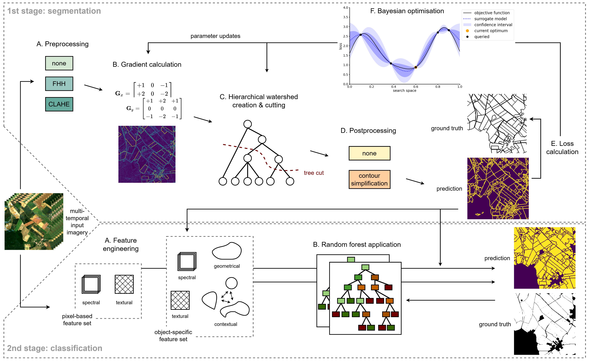
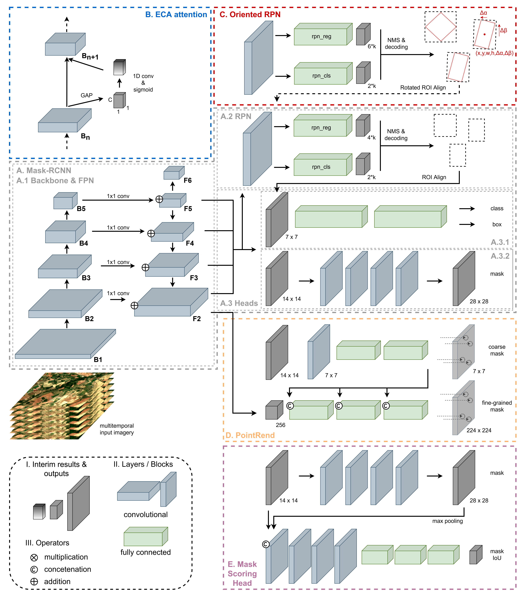

## AI4Boundaries - Agricultural parcel delineation based on multitemporal Sentinel-2 data

>**Note**  
> <i>For all details of content, see the [master's thesis](https://fkroeber.de/masters-thesis/) in the context of which the models and data processing pipelines were developed.</i>

This repository contains the code to train and evaluate two supervised models for agricultural parcel delineation. The 1<sup>st</sup> one ([machine learning driven OBIA](#model-a-machine-learning-driven-obia)) is based on a hierarchical watershed segmentation embedded in a Bayesian optimisation framework and combined with a random forest classifier. The 2<sup>nd</sup> one ([deep instance segmentation](#model-b-deep-instance-segmentation)) is an enhanced Mask-RCNN architecture incorporating attention mechanisms, oriented region proposals/bounding boxes and mask scoring. Both models were trained and evaluated using an enhanced version of the [AI4Boundaries dataset](https://doi.org/10.5194/essd-15-317-2023). The corresponding scripts for exploratory data analysis and data preprocessing are also provided in this repository. The final configurations and weights for the trained models can be downloaded [here](https://1drv.ms/f/s!AlhSFEgs5NDDjbFrgzFhbG732wujog?e=9G7zrb).

### Repository structure
```
|-- README.md
|-- docs
|   |-- overview_deep.png
|   `-- overview_obia.png
|-- env.yaml
`-- src
    |-- dl
    |   |-- all.py
    |   |-- mm_extensions
    |   |   |-- README.md
    |   |   |-- dataloading
    |   |   |   |-- __init__.py
    |   |   |   |-- conversion.py
    |   |   |   |-- dataset.py
    |   |   |   `-- loading.py
    |   |   |-- evaluation
    |   |   |   |-- __init__.py
    |   |   |   |-- coco_api.py
    |   |   |   `-- rot_coco_metric.py
    |   |   `-- models
    |   |       |-- __init__.py
    |   |       |-- backbones.py
    |   |       |-- mask_heads.py
    |   |       `-- utils.py
    |   `-- postprocess.py
    |-- eda
    |   |-- eda_images.py
    |   `-- eda_labels.py
    |-- eval
    |   |-- all.py
    |   |-- instance.py
    |   `-- segment.py
    |-- obia
    |   |-- all.py
    |   |-- cws.py
    |   |-- gradient.py
    |   `-- rf.py
    |-- preprocess
    |   |-- filtering.py
    |   `-- subsetting.py
    `-- utils
        |-- common.py
        `-- geo.py
```

### Model A: Machine learning driven OBIA
  

### Model B: Deep instance segmentation
  
